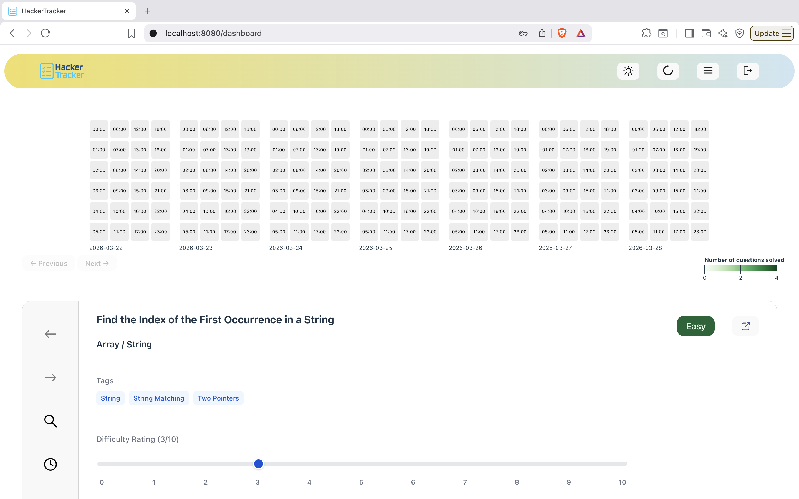
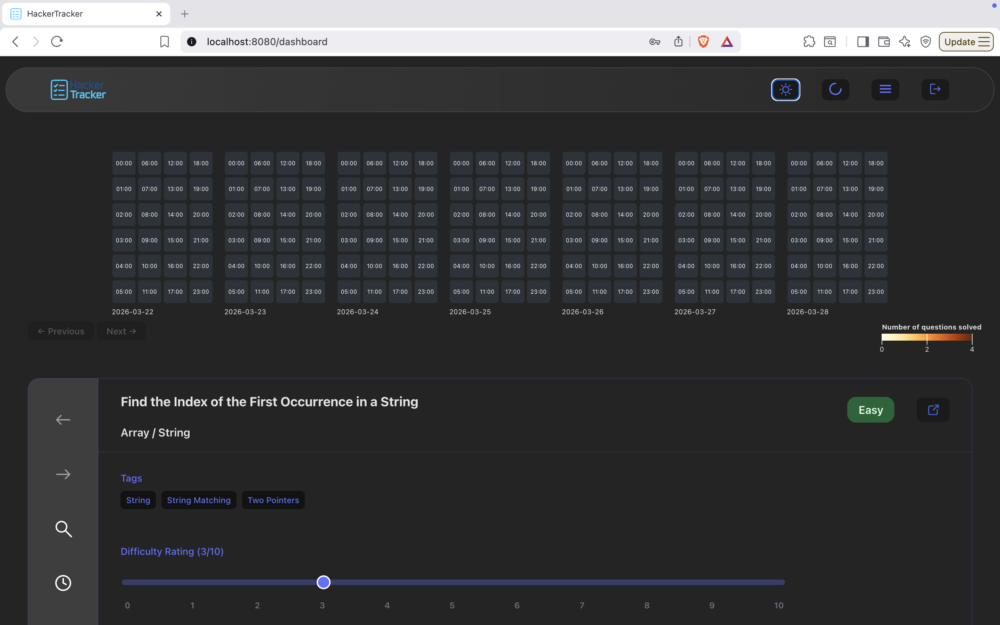
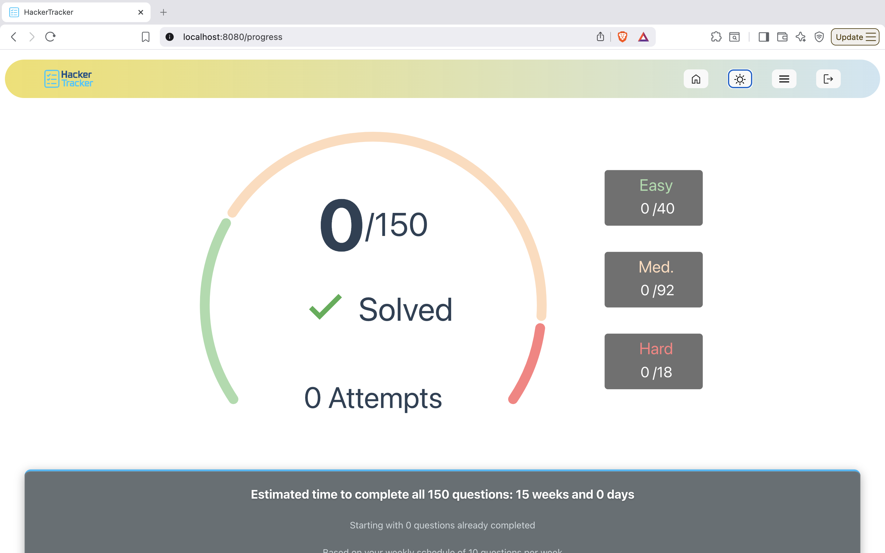
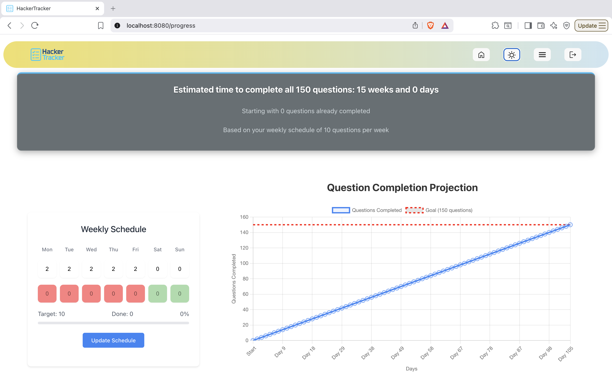

# 🎯 HackerTracker

A comprehensive LeetCode progress tracking and intelligent scheduling platform designed to help you master the **LeetCode Top 150 Questions**. HackerTracker combines progress tracking, smart scheduling, and a rules based recommendation system to optimize your coding interview preparation.

## Features

### 📊 Progress Tracking
- **Problem Completion Logging**: Track which LeetCode Top 150 questions you've completed with detailed notes
- **Performance Metrics**: Monitor your progress across difficulty levels (Easy, Medium, Hard) and topics (Arrays, Strings, Trees, etc.)
- **Completion Rate Analytics**: Visualize your journey with an eye-opening progress dashboard.

### ⏱️ Time Management
- **Session Timing**: Time your problem-solving sessions to understand your pace and efficiency
- **Historical Tracking**: Review your progress history to identify improvement areas

### 📅 Smart Scheduling
- **Personalized Schedules**: Create custom study schedules based on your target timeline and availability
- **Rules-based Recommender**: The scheduler analyzes:
  - How you rank questions (difficulty perception vs. actual difficulty)
  - Your completion history by topic and difficulty
  - Your learning pace and patterns
  - Available time slots
- **Dynamic Recommendations**: Receive personalized next-question suggestions to optimize your preparation

### 👥 User Management
- **Secure Registration**: Create accounts with password authentication
- **User Profiles**: Customize your learning preferences and goals
- **Progress Persistence**: All your data is saved and synchronized across sessions

### 🔍 Advanced Search
- **Full-Text Search**: Search problems by title, description, and tags using Hibernate Search
- **Topic Filtering**: Browse and filter questions by topic and difficulty
- **Smart Tagging**: Organize problems with custom tags for better organization

## Screenshots

### Main Dashboard
<div style="display: flex; gap: 20px;">
  <div style="flex: 1;">
    <h4>Light Mode</h4>
    

  </div>
  <div style="flex: 1;">
    <h4>Dark Mode</h4>
    

  </div>
</div>

### Progress Analytics
<div style="display: flex; gap: 20px;">
  <div style="flex: 1;">
    

  </div>
  <div style="flex: 1;">
    

  </div>
</div>

## Tech Stack

| Component | Technology |
|-----------|-----------|
| **Backend Framework** | Spring Boot 3.4.4 |
| **Java Version** | Java 21 |
| **Security** | Spring Security with JWT |
| **Database** | MySQL |
| **ORM** | Hibernate 6.6.13 |
| **Search Engine** | Hibernate Search (Apache Lucene) |
| **Caching** | EHCache with JCache |
| **Frontend** | JSP with HTML/CSS/JavaScript |
| **Styling** | SCSS |
| **Build Tool** | Maven |

## Prerequisites

Before you begin, ensure you have the following installed on your system:

- **Java 21** or higher ([Download](https://www.oracle.com/java/technologies/downloads/))
- **Maven 3.8.0** or higher ([Download](https://maven.apache.org/download.cgi))
- **MySQL Server 8.0** or higher ([Download](https://dev.mysql.com/downloads/mysql/))
- **Git** ([Download](https://git-scm.com/))

## Deployment Instructions (Local)

### Fork the Repository and Clone It

```bash
# Clone the repository
git clone https://github.com/yourusername/hackertracker.git
cd Hackertracker/
```

### Configure Environment Variables

Update `src/main/resources/application.properties` with your local configuration:

```properties
# MySQL Configuration
spring.datasource.url=jdbc:mysql://localhost:3306/hack_bis?createDatabaseIfNotExist=true
spring.datasource.username=root
spring.datasource.password=root

# JWT Secret (update with a secure key for production)
jwt.secret=<your-jwt-secret>

# Hibernate Search Index Directory
hibernate.search.index.directory=./hibernate-search-indexes
```

**Database Setup:**
```bash
# MySQL will automatically create the database specified above
# Ensure MySQL is running on localhost:3306
```

### Build and Run

```bash
# Build the project
mvn clean install

# Run the application
mvn spring-boot:run
```

The application will start on `http://localhost:8080`


### Stop the Application

```bash
# Press Ctrl+C in the terminal running the application
```

## Validation Rules

### User Registration
- **Username**: 3-20 characters, alphanumeric with underscores
- **Email**: Valid email format
- **Password**: Minimum 8 characters, must include uppercase, lowercase, number, and special character
- **Note**: All usernames and emails must be unique

### User Update
- **Email**: Optional, must be valid email format if provided
- **Name Fields**: Optional, 1-50 characters if provided

### Problem Completion
- **Notes**: Optional, maximum 5000 characters
- **Time Taken**: Positive integer representing minutes
- **Problem ID**: Must refer to valid problem in database

## Testing

### Make the Tests Executable

```bash
chmod +x mvnw
```

### Build and Run Tests

```bash
# Run all tests
mvn test

# Run tests for a specific module
mvn test -Dtest=UserRepositoryTest

# Run tests with coverage report
mvn test jacoco:report
```

Test results will be available in `target/surefire-reports/`

## Database Management

### Access MySQL

```bash
# Connect to MySQL
mysql -u root -p

# Enter password when prompted
```

### Navigate to Database

```sql
-- Use HackerTracker database
USE hack_bis;

-- View all tables
SHOW TABLES;

-- View user data (excluding passwords)
SELECT id, username, email, created_at FROM user;

-- View completion statistics
SELECT u.username, COUNT(c.id) as problems_completed
FROM user u
LEFT JOIN user_problem_completion c ON u.id = c.user_id
GROUP BY u.id;
```

### Reset Database (Development Only)

```bash
# Stop the application first
# Then delete the Hibernate Search indexes
rm -rf hibernate-search-indexes/

# Delete the database
mysql -u root -p < drop_database.sql

# Restart application (it will recreate tables with schema)
mvn spring-boot:run
```

**SQL to save in `drop_database.sql`:**
```sql
DROP DATABASE IF EXISTS hack_bis;
```

## Maintenance Commands

### View Logs

```bash
# View application logs in real-time
tail -f app.log

# View logs from the past hour
tail -f app.log | grep "$(date -d '1 hour ago' +%H:)"

# Search for errors
grep ERROR app.log
```

### Stop Services

```bash
# Stop MySQL (macOS with Homebrew)
brew services stop mysql-server

# Stop MySQL (Linux with systemd)
sudo systemctl stop mysql

# Stop the application
# Press Ctrl+C in the running terminal
```

### Rebuild Application

```bash
# Clean rebuild (removes old build artifacts)
mvn clean install

# Rebuild with fastest startup
mvn clean install -DskipTests

# Rebuild with test execution
mvn clean install -X  # -X for debug output
```

### JWT Token Security

- **Token Expiration**: Configure token lifespan in `application.properties`
- **Token Refresh**: Implement refresh token endpoints for long-term sessions
- **Secure Secret**: Use a strong, randomly-generated secret key
- **HTTPS Only**: Always use HTTPS in production
- **Token Storage**: Never store tokens in localStorage; use secure httpOnly cookies

## Architecture

### Technology Choices

| Component | Choice | Rationale |
|-----------|--------|-----------|
| **Spring Boot** | Latest stable (3.4.4) | Modern features, excellent ecosystem, easy deployment |
| **JWT Security** | Spring Security + JJWT | Stateless authentication, ideal for REST APIs |
| **Hibernate Search** | Apache Lucene backend | Fast full-text search on LeetCode problems |
| **Caching** | EHCache | Reduces database load, improves performance |
| **JSP Templates** | Server-side rendering | Quick development, suitable for this project scope |

### Database Schema Highlights

**Key Entities:**
- **User**: Stores user accounts and authentication data
- **Problem**: LeetCode Top 150 problems with metadata
- **UserProblemCompletion**: Tracks user's problem-solving history
- **UserSchedule**: Personalized study schedules
- **Topic**: Problem categories (Arrays, Strings, Trees, etc.)
- **Tag**: Custom tags for better organization

**Relationships:**
- User → One-to-Many → UserProblemCompletion (user solves many problems)
- User → One-to-One → UserSchedule (each user has one active schedule)
- Problem → Many-to-Many → Topic (problems can belong to multiple topics)
- UserProblemCompletion → Many-to-Many → Tag (completions can have multiple tags)

## Project Structure

```
src/
├── main/
│   ├── java/com/hackertracker/
│   │   ├── auth/              # Authentication & authorization logic
│   │   ├── config/            # Spring configurations (security, cache, etc.)
│   │   ├── controllers/       # REST API endpoints & request handlers
│   │   ├── dao/               # Data Access Objects (repository layer)
│   │   ├── dto/               # Data Transfer Objects (API models)
│   │   ├── indexer/           # Hibernate Search indexing logic
│   │   ├── problem/           # Problem entity & business logic
│   │   ├── schedule/          # Scheduling & recommendation engine
│   │   ├── security/          # Security configurations & filters
│   │   ├── tag/               # Tag management
│   │   ├── topic/             # Topic management
│   │   ├── user/              # User entity & services
│   │   └── validator/         # Input validation logic
│   └── resources/
│       ├── application.properties
│       ├── static/            # CSS, JavaScript, images
│       └── templates/         # JSP views
└── test/                       # Unit and integration tests

hibernate-search-indexes/      # Full-text search index (auto-generated)
target/                        # Build artifacts
```

## Troubleshooting

### Port Already in Use

**Problem**: Error `Address already in use :8080`

**Solutions:**
```bash
# Find process using port 8080
lsof -i :8080

# Kill process (get PID from above)
kill -9 <PID>

# Or configure different port in application.properties
server.port=8081
```

### Database Connection Failed

**Problem**: Error `Connection refused: localhost:3306`

**Solutions:**
```bash
# Check if MySQL is running
mysql -u root -p -e "SELECT 1"

# Start MySQL (macOS with Homebrew)
brew services start mysql-server

# Start MySQL (Linux with systemd)
sudo systemctl start mysql

# Verify credentials in application.properties
cat src/main/resources/application.properties | grep datasource
```

### Application Won't Start

**Problem**: Spring Boot startup failures or cryptic errors

**Solutions:**
```bash
# Check logs for specific errors
mvn spring-boot:run 2>&1 | grep -i error

# Verify Java version
java -version  # Should be 21+

# Clean rebuild with verbose output
mvn clean install -X

# Check Java path if using multiple installations
which java
echo $JAVA_HOME
```

### Hibernate Search Index Issues

**Problem**: Full-text search not working or index corruption

**Solutions:**
```bash
# Rebuild Hibernate Search indexes (automatic on first run)
rm -rf hibernate-search-indexes/
mvn clean install


## Contributing

1. Fork the repository
2. Create your feature branch (`git checkout -b feature/amazing-feature`)
3. Commit your changes (`git commit -m 'Add amazing feature'`)
4. Push to the branch (`git push origin feature/amazing-feature`)
5. Open a Pull Request

## License

This project is licensed under the MIT License - see the LICENSE file for details.

## Support

For issues, questions, or suggestions:
- Open an issue on GitHub
- Check existing issues for similar problems
- Provide detailed error messages and logs when reporting bugs

---

**Happy coding! Good luck with your LeetCode preparation! 🚀**

